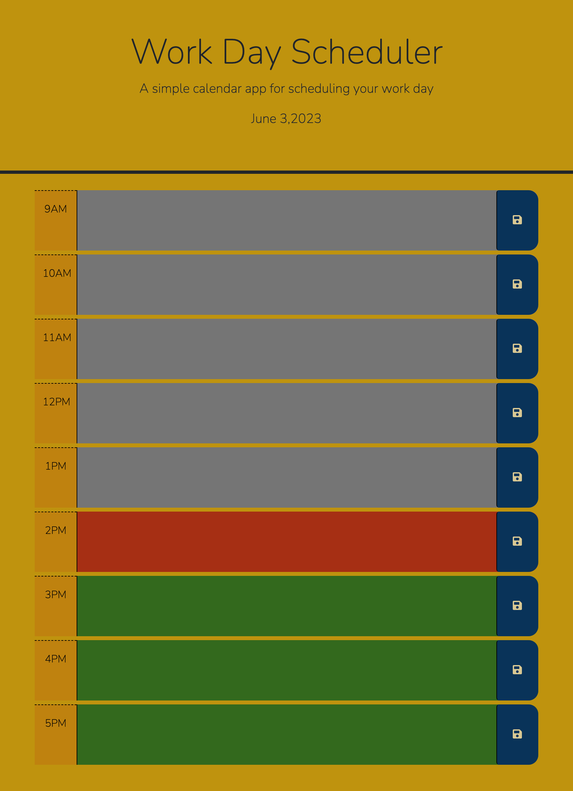

# Day Planner (Bootcamp Challenge 5)

## Project Description 

Starting with base code, JQuery and html were used to create a functional day planner for a work day starting at 9am and ending at 5pm with user input being saved to local storage and displayed on the webpage itself in it's correlating time block. 
The use to DayJS allowed for the current date and time to be followed keep the website current and practically functional for the user. 
Along with this practical functionality is the added aesthetic of being able to quickly tell the current hour based on colour coding through a CSS stylesheet. 

After completing the main objectives, to continue some CSS work I customized simple aspects of the webpage including font, spacing and it's color palette.

## Future Features

Features to include to make this website even more functional:
- Extending the time blocks to include all 24 hours
- Adding a username and password for users to be able to access their information
- Putting in monthly and weekly pages that are connected to the daily planner so that users can see an overview of their booked and free time
-Light and Dark features to make the page more styalistically customizable based on user preference or local time of day

## Deployed Website Link and Image

## License

MIT License

